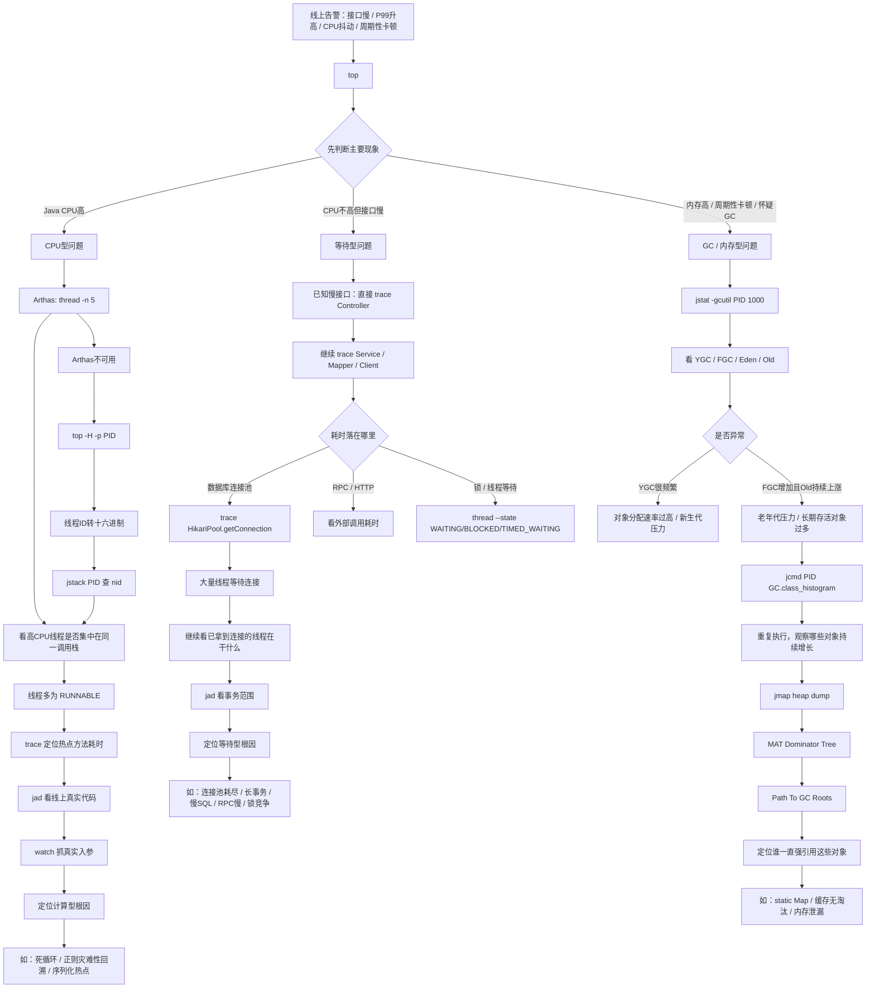

# Java 线上慢接口排障总流转图

> 目标：把 CPU 高、CPU 不高但接口慢、JVM 频繁 GC 三类场景统一到一张图里。先判断问题属于“算、等、内存”中的哪一类，再进入对应排查链路。

---

## 一、统一入口：先从 `top` 开始

`top` 不是最终定位工具，但非常适合做统一入口，因为它先帮我们判断：

- Java 进程 CPU 是否明显升高
- 机器整体是否繁忙
- Java 进程内存是否异常偏高
- 是否存在 CPU 不高但接口 RT 仍然很高的情况

因此三类慢接口问题都可以先从：

```bash
top
```

开始。

---

## 二、总流转图



---

## 三、最核心的第一层判断

以后看到线上慢接口，先不要急着猜 Redis、MySQL 或 GC。

先问一句：

> **线程现在是在“算”，还是在“等”，还是内存已经顶住了？**

可以先记成：

```text
top
 ↓
├─ CPU高
│   ↓
│  看线程是不是一直 RUNNABLE
│   ↓
│  计算型问题
│
├─ CPU不高但接口慢
│   ↓
│  看 WAITING / TIMED_WAITING / BLOCKED
│   ↓
│  资源等待型问题
│
└─ 内存高 / 周期性卡顿 / GC异常
    ↓
   看 YGC / FGC / Old
    ↓
   GC / 内存型问题
```

---

# 四、分支一：CPU 高 —— 看线程是不是在“算”

典型入口：

```text
top
 ↓
Java CPU 高
```

有 Arthas 时优先：

```bash
thread -n 5
```

目标：

> 找出最耗 CPU 的 Java 线程以及它们当前的调用栈。

如果多个高 CPU 线程都集中到同一个方法，并且线程状态多为：

```text
RUNNABLE
```

说明这些线程不是在等待，而是在持续做计算。

继续：

```text
thread -n 5
 ↓
trace
 ↓
jad
 ↓
watch
```

分别解决：

```text
thread
→ 哪些线程在吃 CPU？

trace
→ 时间具体花在哪个方法调用？

jad
→ JVM 当前真正运行的代码是什么？

watch
→ 什么真实输入触发了问题？
```

典型根因：

- 死循环
- 正则灾难性回溯
- 大量 JSON/序列化计算
- 大对象处理
- 某段业务算法复杂度过高

### Arthas 不可用时

走传统链路：

```text
top
 ↓
top -H -p PID
 ↓
找到高 CPU TID
 ↓
printf 转十六进制
 ↓
jstack PID
 ↓
通过 nid 找 Java 调用栈
```

---

# 五、分支二：CPU 不高但接口慢 —— 看线程是不是在“等”

典型入口：

```text
top
 ↓
CPU正常
 ↓
但接口 P99 很高
```

这个时候不能直接猜“慢 SQL”。

线程可能在等：

- 数据库连接
- SQL
- Redis
- HTTP / RPC
- 锁
- 线程池
- 连接池
- CompletableFuture

如果已知慢接口，可以直接从接口入口：

```bash
trace Controller方法 '#cost > 100'
```

然后逐层往里：

```text
Controller
 ↓
Service
 ↓
Mapper / Redis / RPC / Client
```

例如发现：

```text
InventoryMapper.selectById()
≈ 4 秒
```

此时仍不能直接说：

> SQL 执行了 4 秒。

因为里面可能是：

```text
先等数据库连接 4 秒
 ↓
真正 SQL 只执行几十毫秒
```

因此继续拆连接池：

```bash
trace com.zaxxer.hikari.pool.HikariPool getConnection '#cost > 100'
```

如果发现 `getConnection()` 本身就耗时数秒，再看：

```bash
thread --state WAITING
thread --state TIMED_WAITING
thread --state BLOCKED
```

目标是找到：

> 大量线程到底在等什么。

典型根因：

- 数据库连接池耗尽
- 长事务占着连接去等 RPC
- 慢 SQL 长时间占连接
- 锁竞争
- 外部 RPC 超时
- Redis 变慢
- 线程池任务堆积

---

# 六、分支三：频繁 GC / 内存问题 —— 看对象为什么活得这么久

典型入口：

```text
top
 ↓
Java 内存高 / CPU周期性冲高 / 接口周期性卡顿
```

`top` 只能提供线索，真正判断 GC 要看：

```bash
jstat -gcutil PID 1000
```

重点看：

```text
E     Eden使用率
O     Old老年代使用率
YGC   Young GC次数
YGCT  Young GC累计耗时
FGC   Full GC次数
FGCT  Full GC累计耗时
```

典型现象：

```text
Eden很快涨满
 ↓
YGC不断增加
```

说明：

> 对象分配速度很快。

如果：

```text
Old
91%
92%
93%
94%
 ↓
Full GC
 ↓
67%
 ↓
又继续上涨
```

说明：

```text
大量对象不断进入老年代
 ↓
Full GC后仍有大量对象存活
```

此时怀疑：

- 长期存活对象过多
- 缓存过大
- 对象被意外强引用
- 内存泄漏

继续：

```bash
jcmd PID GC.class_histogram
```

看：

> 哪些类的实例数量和占用最大。

但一次 histogram 不能证明泄漏。

应该：

```text
第一次 histogram
 ↓
过一段时间
 ↓
第二次 histogram
 ↓
看哪些业务对象持续增长
```

如果对象持续增长，并且 GC 后也降不下来，再进入 Heap Dump：

```bash
jmap -dump:live,format=b,file=/tmp/heap.hprof PID
```

然后使用 MAT：

```text
Dominator Tree
 ↓
看 Retained Heap
 ↓
Path To GC Roots
 ↓
找谁一直强引用对象
```

典型根因：

```text
GC Root
 ↓
Class
 ↓
static CACHE
 ↓
ConcurrentHashMap
 ↓
大量业务对象
```

最终结论不是：

> GC 回收能力不够。

而是：

> 对象仍然有强引用，所以 GC 根本不能回收。

---

# 七、三类问题对照表

| 场景 | 最典型线程/内存现象 | 第一批核心工具 | 主要目标 |
|---|---|---|---|
| CPU 型 | `RUNNABLE`、Java CPU 高 | `thread -n 5`、`jstack`、`trace` | 找谁一直在计算 |
| 等待型 | `WAITING` / `TIMED_WAITING` / `BLOCKED` | `trace`、`thread --state` | 找线程在等什么资源 |
| GC / 内存型 | YGC/FGC 异常、Old 持续上涨 | `jstat`、`jcmd`、Heap Dump、MAT | 找什么对象活得太久、谁在引用它 |

---

# 八、三条实战链路压缩版

## CPU 型

```text
top
→ Java CPU高
→ Arthas thread -n 5
→ RUNNABLE热点线程
→ trace
→ jad
→ watch
→ 计算热点根因
```

## 等待型

```text
top
→ CPU正常但RT高
→ trace慢接口
→ 定位耗时层
→ thread --state
→ 看数据库/连接池/RPC/锁等待
→ jad确认代码范围
→ 资源等待根因
```

## GC / 内存型

```text
top
→ 内存高/周期性卡顿
→ jstat -gcutil
→ YGC/FGC/Old异常
→ jcmd GC.class_histogram
→ 对比对象增长
→ heap dump
→ MAT Dominator Tree
→ Path To GC Roots
→ 内存泄漏根因
```

---

# 九、面试一句话回答

> 线上慢接口我一般先从 `top` 做统一入口，先判断问题主要属于 CPU 计算、资源等待还是 JVM 内存/GC。CPU 高时重点看 RUNNABLE 热点线程和调用栈；CPU 不高但 RT 高时沿调用链 trace，定位数据库、连接池、RPC 或锁等待；如果是周期性卡顿或 GC 异常，则通过 jstat、class histogram、Heap Dump 和 MAT 一路定位到对象增长和 GC Root 引用链。核心不是背命令，而是先判断线程到底是在“算”、在“等”，还是对象“活得太久”。
